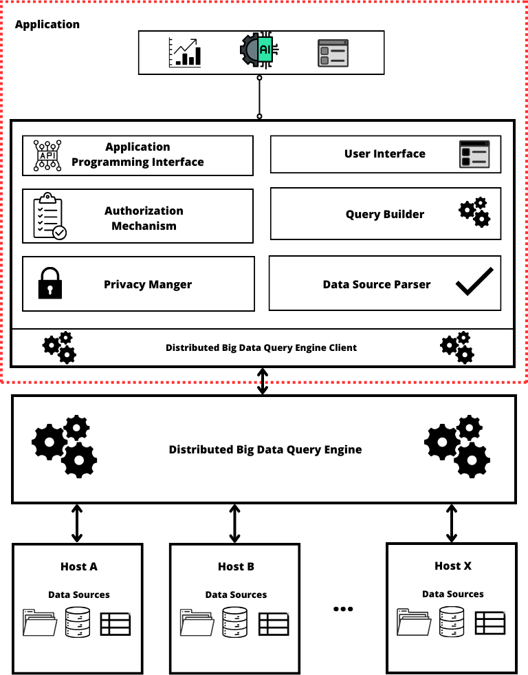

---

<p align="center">

</p>

---
# DBD-Guardian
A Big Data Cybersecurity Analytics System Architeture Based on Distributed Big Data Query Engines

<div align="center">
  <div style="max-width: 400px;">
    
  </div>
  <p>DBD-Guardian Architeture Proposal</p>
</div>

### What is DBD-Guardian?
Distributed Big Data Guardian is a Big Data Cybersecurity architetural proposal that employs a distributed big data query engine to provide real-time monitoring for a multitude of hosts throughout a network, all while mitigating the requirement for extensive resource consumption, such as storage space. Furthermore, DBD-Guardian includes a privacy feature designed to anonymize sensitive data, ensuring data security and compliance, as well as an API designed to allow users to develop and incorporate their costume modules.

This solution is highly customizable, enabling users to adapt its functionality to suit their specific needs, allowing DBD-Guardian to be effectively implemented in a wide range of use cases. 

### DBD-Guardian Implementation
To evaluate the capabilities of our proposal, we implemented DBD-Guardian using the Trino distributed query engine. We selected the Trino Python Client as the query engine client. The user interface (UI) was created with Vue.js, and all other application's modules were developed using the Flask framework.

### DBD-Guardian's Paper Abstract
Big Data Cybersecurity Analytics (BDCA) is a helpful tool for cybersecurity maintenance that may support the identification of potential threats. Data preparation for traditional BDCA environments contains several steps comprising data movement, transformation, aggregation, and processing. All these steps take place before data becomes accessible to users. Executing such a workflow may take a reasonable time, which increases significantly with the growing amount and variety of available data sources for analytic operations. As the elapsed time between the actual occurrence of cybersecurity events and data availability for analytical queries grows, BDCA’s usefulness decreases. In this work, we deal with near real-time BDCA. We propose DBD-Guardian, a system that runs distributed queries over cybersecurity data sources (e.g., log files) while stored in their original location. DBD-Guardian supports querying heterogeneous unstructured and semi-structured sources by using specialized parsers. Also, as data sources are in their raw format, DBD-Guardian has a component specially designed to deal with sensitive data, providing access to anonymized data. To evaluate our proposals, we prototyped DBD-Guardian and implemented a representative scenario of a small company with several hosts and log files of different types. We also simulated several malicious operations in this scenario and assessed the DBD-Guardian ability to support intrusion identification and enforce privacy protection. We evaluated analytic operations’ response time as well. The results proved our solution efficiently supports analytical operations and threat identification and also demonstrated the solution’s adaptability to distributed and heterogeneous environments. 

https://ieeexplore.ieee.org/document/10713390

### Paper Citation
To cite this work please use:
```bibtex
@article{dbdguardian2024,
  author={José Frade and Leonel Santos and Ro\'erio Lu\'is de C. Costa},
  journal={IEEE Access}, 
  title={DBD-Guardian and Privacy-Aware Near Real-Time Cybersecurity Analytics}, 
  year={2024},
  volume={12},
  number={},
  pages={149787-149803},
  doi={10.1109/ACCESS.2024.3477979}
}
```

# Acknowledgements
This work is part of the project Security Analytics and partially funded by national funds through FCT – Fundação para a Ciência e a Tecnologia, I.P., under the Scientific Employment Stimulus - Institutional Call - CEECINST/00051/2018 and in the context of the project UIDB/04524/2020.
